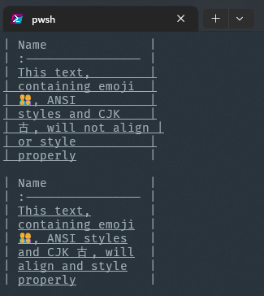

# tablemark &middot; [](https://www.npmjs.com/package/tablemark) [](https://www.npmjs.com/package/tablemark) [](http://www.typescriptlang.org/docs/handbook/typescript-in-5-minutes.html) 

> Generate markdown tables from JSON data.

Render arrays of objects as markdown tables, with configurable fancy output.

- Rename table headers and transform cell content
- Align columns to the left, center, or right (all columns or per column)
- Customize text casing for column headers (using [`change-case`])
- Auto-detect and handle [ANSI styles and Unicode characters](#optionstexthandlingstrategy)
- Wrap or truncate long cell contents or strip line breaks

## Installation

```shell
pnpm add tablemark

# or
npm install tablemark

# or
yarn add tablemark

# or
bun add tablemark
```

## Usage

```js
import { tablemark } from "tablemark";
```

```js
tablemark([
	{ name: "Bob", age: 21, isCool: false },
	{ name: "Sarah", age: 22, isCool: true },
	{ name: "Lee", age: 23, isCool: true }
]);

// | Name  | Age   | Is cool |
// | :---- | :---- | :------ |
// | Bob   | 21    | false   |
// | Sarah | 22    | true    |
// | Lee   | 23    | true    |
```

... displays as:

<!-- prettier-ignore-start -->
| Name  | Age   | Is cool |
| :---- | :---- | :------ |
| Bob   | 21    | false   |
| Sarah | 22    | true    |
| Lee   | 23    | true    |
<!-- prettier-ignore-end -->

## API

```ts
tablemark (input: InputData, options?: TablemarkOptions): string
```

> **Arguments**

- `InputData` input: the data to table-ify as an array or iterable of objects
  - Note that nested objects are not supported. Use
    [`options.toCellText`](#optionstocelltext) to customize how nested objects
    and other non-string values are output.

- `TablemarkOptions` options:

  |           key            |                     type                     |     default      | description                                                                                        |
  | :----------------------: | :------------------------------------------: | :--------------: | -------------------------------------------------------------------------------------------------- |
  |         `align`          |       `"left" \| "center" \| "right"`        |     `"left"`     | Horizontal alignment to use for all columns.                                                       |
  |        `columns`         |     `Array<string \| ColumnDescriptor>`      |        -         | Array of [column descriptors](#optionscolumns).                                                    |
  |       `headerCase`       |             `"preserve" \| ...`              | `"sentenceCase"` | Casing to use for headers derived from input object keys ([read more](#optionsheadercase)).        |
  |   `lineBreakStrategy`    |    `"preserve" \| "strip" \| "truncate"`     |   `"preserve"`   | What to do when cell content contains line breaks.                                                 |
  |       `lineEnding`       |                   `string`                   |      `"\n"`      | String used at end-of-line.                                                                        |
  |        `maxWidth`        |                   `number`                   |    `Infinity`    | Wrap cell text at this length.                                                                     |
  |    `overflowStrategy`    | `"wrap" \| "truncateStart" \| "truncateEnd"` |     `"wrap"`     | How to handle overflowing text in cells.                                                           |
  | `overflowHeaderStrategy` | `"wrap" \| "truncateStart" \| "truncateEnd"` |     `"wrap"`     | How to handle overflowing text in header cells.                                                    |
  |   `padHeaderSeparator`   |                  `boolean`                   |      `true`      | Whether to pad gutters of the header separator (alignment) row.                                    |
  |       `toCellText`       |         `({ key, value }) => string`         |        -         | Provide a custom cell value transform function.                                                    |
  |     `toHeaderTitle`      |         `({ key, title }) => string`         |        -         | Provide a custom header title transform function.                                                  |
  |   `unknownKeyStrategy`   |            `"ignore" \| "throw"`             |    `"ignore"`    | How to handle unknown keys found in objects.                                                       |
  |  `textHandlingStrategy`  |      `"auto" \| "advanced"` \| `basic`       |     `"auto"`     | Control support for ANSI styles or Unicode characters ([read more](#optionstexthandlingstrategy)). |
  |    `wrapWithGutters`     |                  `boolean`                   |     `false`      | Add sides (`\| <content> \|`) to wrapped rows.                                                     |

> **Returns**

`string`: the resulting markdown formatted table

If `input` is an empty array, an empty string is returned.

> **Throws**

`TypeError`: when `input` is not iterable (e.g., an array)<br />
`TypeError`: when an unknown column alignment option is provided<br />
`RangeError`: when `config.unknownKeyStrategy === "throw"` and an unknown key in an object is encountered

> [!NOTE]
> The keys of the first encountered object are used for the table's headers.
> By default, any other keys from successive objects will be ignored,
> excluding those columns from the table. You can customize this behavior to
> make this raise an error by using `config.unknownKeyStrategy`.

### `options.align`

Set the horizontal alignment for all columns. Accepts `"left"`, `"center"`, or `"right"`.

```js
tablemark(
	[
		{ name: "Bob", age: 21 },
		{ name: "Sarah", age: 22 }
	],
	{ align: "center" }
);

// | Name  | Age |
// | :---: | :-: |
// | Bob   | 21  |
// | Sarah | 22  |
```

### `options.columns`

Describe the columns of the table. Each column can be a simple string to rename the column or an object with properties to further customize the column's behavior. Tthe following properties are available and will override behavior specified elsewhere in `options`:

- `name`: Name of the column used as the title in the header row.
- `align`: Horizontal alignment of the column content.
- `maxWidth`: Maximum content width of this column.
- `overflowHeaderStrategy`: How to handle overflowing text in header cells. Defaults to `"wrap"`.
- `overflowStrategy`: How to handle overflowing text in this column. Defaults to the root `overflowStrategy`.
- `textHandlingStrategy`: How to handle text in this column. Defaults to the root `textHandlingStrategy`.
- `width`: Fixed display width for the column, overriding both the root- and column-level `maxWidth` setting.

```js
tablemark(
	[
		{ name: "Bob", age: 21, isCool: false },
		{ name: "Sarah", age: 22, isCool: true },
		{ name: "Lee", age: 23, isCool: true }
	],
	{
		columns: [
			"first name",
			{ name: "how old", align: "center" },
			"are they cool"
		]
	}
);

// | first name | how old | are they cool |
// | :--------- | :-----: | :------------ |
// | Bob        |   21    | false         |
// | Sarah      |   22    | true          |
// | Lee        |   23    | true          |
```

... displays as:

<!-- prettier-ignore-start -->
| first name | how old | are they cool |
| :--------- | :-----: | :------------ |
| Bob        |   21    | false         |
| Sarah      |   22    | true          |
| Lee        |   23    | true          |
<!-- prettier-ignore-end -->

### `options.headerCase`

Control the casing of headers derived from input object keys. The default is `"sentenceCase"`. The options are:

- `"preserve"`: Keep the original case
- `"camelCase"`: Example: twoWords
- `"capitalCase"`: Example: Two Words
- `"constantCase"`: Example: TWO_WORDS
- `"dotCase"`: Example: two.words
- `"kebabCase"`: Example: two-words
- `"noCase"`: Example: two words
- `"pascalCase"`: Example: TwoWords
- `"pascalSnakeCase"`: Example: Two_Words
- `"pathCase"`: Example: two/words
- `"sentenceCase"`: Example: Two words
- `"snakeCase"`: Example: two_words
- `"trainCase"`: Example: Two-Words

```js
tablemark([{ first_name: "Bob", last_name: "Smith" }], {
	headerCase: "constantCase"
});

// | FIRST_NAME | LAST_NAME |
// | :--------- | :-------- |
// | Bob        | Smith     |
```

### `options.lineBreakStrategy`

Specify how to handle line breaks in cell content. The options are:

- `"preserve"` (default): Keep line breaks
- `"strip"`: Replace line breaks with spaces
- `"truncate"`: Trim content at the first line break

```js
tablemark([{ note: "Line 1\nLine 2" }], { lineBreakStrategy: "strip" });

// | Note          |
// | :------------ |
// | Line 1 Line 2 |
```

### `options.lineEnding`

Set the string used at the end of each line. The default is `\n` (linefeed).

```js
tablemark([{ name: "Bob" }], { lineEnding: "\r\n" });
```

### `options.maxWidth`

Set `options.maxWidth` to wrap any content at that length onto a new
adjacent line:

```js
tablemark(
	[
		{ star: false, name: "Benjamin" },
		{ star: true, name: "Jet Li" }
	],
	{ maxWidth: 5 }
);

// | Star  | Name  |
// | :---- | :---- |
// | false | Benja |
//           min
// | true  | Jet   |
//           Li
```

> [!NOTE]
> To output valid [GitHub Flavored Markdown](https://github.github.com/gfm/) a
> cell must not contain newlines. Consider replacing those with `<br />` (e.g.,
> using `options.toCellText`).

### `options.overflowHeaderStrategy`

Control how overflowing text in header cells is handled. The options are the same as `overflowStrategy`. The default is `"wrap"`.

### `options.overflowStrategy`

Control how overflowing text in cells is handled. The options are:

- `"wrap"`: Wrap text to a new line
- `"truncateStart"`: Trim overflowing content at the start and replace with `…`
- `"truncateEnd"` (default): Trim overflowing content at the end and replace with `…`

```js
tablemark([{ desc: "This is a long description" }], {
	maxWidth: 17,
	overflowStrategy: "truncateStart"
});

// | Desc              |
// | :---------------- |
// | …long description |
```

### `options.padHeaderSeparator`

Exclude padding around the header's dividing lines (which some formatters prefer).

```js
tablemark(
	[
		{ name: "Bob", age: 21, isCool: false },
		{ name: "Sarah", age: 22, isCool: true },
		{ name: "Lee", age: 23, isCool: true }
	],
	{
		columns: [{ align: "left" }, { align: "center" }, { align: "right" }]
	}
);

// | first name | how old | are they cool |
// |:-----------|:-------:|--------------:|
// | Bob        |   21    | false         |
// | Sarah      |   22    | true          |
// | Lee        |   23    | true          |
```

... displays as:

<!-- prettier-ignore-start -->
| first name | how old | are they cool |
|:-----------|:-------:|--------------:|
| Bob        |   21    | false         |
| Sarah      |   22    | true          |
| Lee        |   23    | true          |
<!-- prettier-ignore-end -->

### `options.textHandlingStrategy`

By default, tablemark attempts to detect and handle text containing characters
like emoji, [halfwidth and
fullwidth](https://en.wikipedia.org/wiki/Halfwidth_and_fullwidth_forms)
characters, and ANSI escape codes (like terminal colors and styles).

Other options, which are only recommended for very specific use cases, are:

- `"auto"` (default): Automatically determine the best text handling strategy
  based on the input data. This is the recommended option for most use cases.
- `"basic"`: Faster, but lacks support for properly wrapping text containing
  certain emojis, halfwidth and fullwidth characters, and ANSI styles.
- `"advanced"`: Forces proper handling of emoji, halfwidth and fullwidth
  characters, and ANSI styles, but is slow for large datasets.

To illustrate the difference, notice how the first example below doesn't
accurately align the `|` characters of the row containing the CJK and doesn't
apply the ANSI styles correctly while the second example does.

```js
tablemark(
	[
		{
			name: "\u001B[4mThis text, containing emoji 👨‍👩‍👧‍👦, ANSI styles and CJK 古, will not wrap or style properly\u001B[0m"
		}
	],
	{
		textHandlingStrategy: "basic",
		maxWidth: 17,
		wrapWithGutters: true
	}
);

// | Name              |
// | :---------------- |
// | This text,        |
// | containing emoji  |
// | 👨‍👩‍👧‍👦, ANSI          |
// | styles and CJK    |
// | 古, will not align |
// | or style          |
// | properly          |

tablemark(
	[
		{
			name: "\u001B[4mThis text, containing emoji 👨‍👩‍👧‍👦, ANSI styles and CJK 古, will wrap and style properly\u001B[0m"
		}
	],
	{
		// Note that this the default value and can be omitted
		textHandlingStrategy: "auto", // or "advanced"
		maxWidth: 17,
		wrapWithGutters: true
	}
);

// | Name              |
// | :---------------- |
// | This text,        |
// | containing emoji  |
// | 👨‍👩‍👧‍👦, ANSI styles   |
// | and CJK 古, will  |
// | align and style   |
// | properly          |
```



### `options.toCellText`

Transform the contents of a body cell. This function is called with an object
containing the `key` of the column and the `value` of the cell and should
return a `string` to be used as the cell's content.

```js
const toCellText = ({ key, value }) => {
	if (value === true) {
		return "✔";
	}

	if (!value) {
		if (key === "studying") {
			return "X";
		}

		return "";
	}

	return value;
};

tablemark(
	[
		{ name: "Bob", pet_owner: true, studying: false },
		{ name: "Sarah", pet_owner: false, studying: true },
		{ name: "Sarah", pet_owner: true, studying: true }
	],
	{
		toCellText,
		columns: [{ align: "left" }, { align: "center" }, { align: "center" }]
	}
);

// | Name  | Pet owner | Studying |
// | :---- | :-------: | :------: |
// | Bob   |     ✔︎     |    X     |
// | Sarah |           |    ✔     |
// | Lee   |     ✔     |    ✔     |
```

#### TypeScript object key inference

If you define your `toCellText` function directly within the `tablemark`
function call as shown above, the type of the `key` property may be
automatically constrained to the keys of your input (if known).

```ts
tablemark([{ name: "Bob", role: "Admin" }], {
	toCellText: ({ key, value }) => {
		// `key` is of type `name | role`
		return value;
	}
});
```

If you want to extract that definition elsewhere, use tablemark's
`ToCellText` type, and combine it with the `GetDataKeys` helper type
for strong typing.

```ts
import { tablemark, type ToCellText, type GetDataKeys } from "tablemark";

const data = [{ name: "Bob", role: "Admin" }] as const;

const toCellText: ToCellText<GetDataKeys<typeof data>> = ({ key, value }) => {
	// `key` is of type `name | role`
	return value;
};

tablemark(data, {
	toCellText
});
```

### `options.toHeaderTitle`

Transform your header titles. This function is called with an object containing
the `key` of the column and the `title` of the header cell and should return a
`string` to be used as the header cell's content.

This transformation is applied _after_ `headerCase`, so this function will be
called with both the original object key as well as the cased title.

```js
const toHeaderTitle = ({ key, title }) => {
	if (key === "name") {
		// Output the title with bold styling, e.g., for command line display
		// (you could use a package like `chalk` to do this)
		return `\u001B[1m${title}\u001B[0m`;
	}

	return title;
};

tablemark(
	[
		{ name: "Bob", pet_owner: true, studying: false },
		{ name: "Sarah", pet_owner: false, studying: true },
		{ name: "Kisha", pet_owner: true, studying: true }
	],
	{
		toHeaderTitle,
		columns: [{ align: "left" }, { align: "center" }, { align: "center" }]
	}
);
```

#### TypeScript object key inference

If you define your `toHeaderTitle` function directly within the `tablemark`
function call as shown above, the type of the `key` property can be
automatically constrained to the keys of your input (if known).

```ts
tablemark([{ name: "Bob", role: "Admin" }], {
	toHeaderTitle: ({ key, title }) => {
		// `key` is of type `name | role`
		return title;
	}
});
```

If you want to extract that definition elsewhere, use tablemark's
`ToHeaderTitle` type, and combine it with the `GetDataKeys` helper type for
strong typing.

```ts
import { tablemark, type ToHeaderTitle, type GetDataKeys } from "tablemark";

const data = [{ name: "Bob", role: "Admin" }] as const;

const toHeaderTitle: ToHeaderTitle<GetDataKeys<typeof data>> = ({
	key,
	title
}) => {
	// `key` is of type `name | role`
	return title;
};

tablemark(data, {
	toHeaderTitle
});
```

### `options.unknownKeyStrategy`

Control how unknown keys in objects are handled:

- `"ignore"` (default): ignore unknown keys
- `"throw"`: throw an error if an unknown key is found

```js
tablemark(
	[
		{ a: 1 },
		{ a: 2, b: 3 } // 'b' is unknown
	],
	{ unknownKeyStrategy: "throw" }
);
// Throws `RangeError`
```

### `options.wrapWithGutters`

Enable `wrapWithGutters` to add pipes on all lines:

```js
tablemark(
	[
		{ star: false, name: "Benjamin" },
		{ star: true, name: "Jet Li" }
	],
	{ maxWidth: 5, wrapWithGutters: true }
);

// | Star  | Name  |
// | :---- | :---- |
// | false | Benja |
// |       | min   |
// | true  | Jet   |
// |       | Li    |
```

## See also

- [`tablemark-cli`](https://github.com/haltcase/tablemark-cli) &ndash; use this module from the command line

And several tools that power tablemark:

- [`ansi-regex`] &ndash; regular expression for matching ANSI escape codes
- [`change-case`] &ndash; convert strings between camelCase, PascalCase, Capital Case, snake_case and more
- [`string-width`] &ndash; get the visual width of a string - the number of columns required to display it
- [`wrap-ansi`] &ndash; wordwrap a string with ANSI escape codes

## Contributing

Search the [issues](https://github.com/haltcase/tablemark/issues) if you come
across any trouble, open a new one if it hasn't been posted, or, if you're
able, open a [pull request](https://help.github.com/articles/about-pull-requests/).
Contributions of any kind are welcome in this project.

The following people have already contributed their time and effort:

- Thomas Jensen (**[@tjconcept](https://github.com/tjconcept)**)

Thank you!

## License

MIT © Bo Lingen / haltcase

[`ansi-regex`]: https://github.com/chalk/ansi-regex
[`change-case`]: https://github.com/blakeembrey/change-case
[`string-width`]: https://github.com/sindresorhus/string-width
[`wrap-ansi`]: https://github.com/chalk/wrap-ansi
